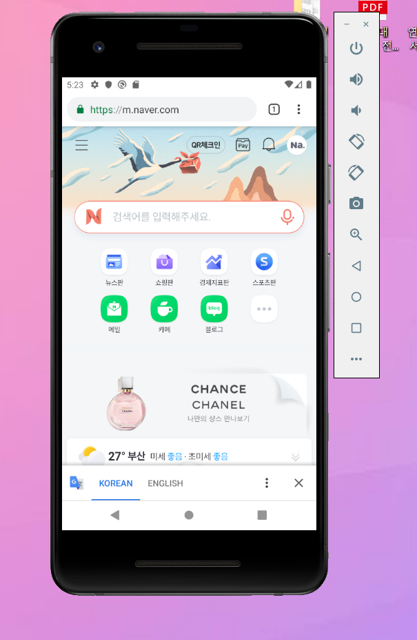
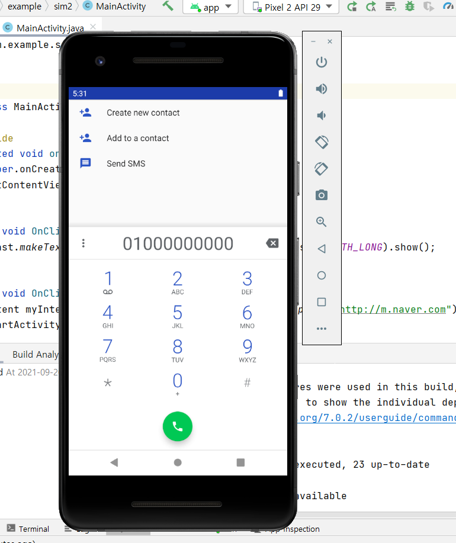
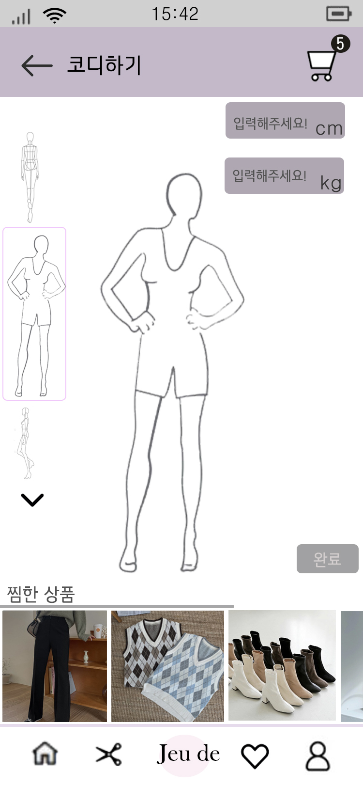

# 20173068_sim_androidApp

## 1주차

## 2주차
  -Github사용법

</img>

## 3주차

</img>
</img>

## 4주차
</img>
- 온라인으로 옷을 샀을 때 실제로 착용을 하지 못해서 사이즈에 안 맞게 구매했던 경험이 다들 한 번쯤은 있을 거라고 생각합니다. 그래서 이러한 문제가 생기지 않게 자신의 신체와 맞게 가상 마네킹을 만들어서 옷을 입혀보는 앱을 구축하고자 합니다.
